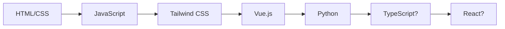

# 👋 Olá! Eu sou Victor Lima

<div align="center">
  
</div>

## 🚀 Sobre mim

Sou um **desenvolvedor front-end em evolução** com uma paixão genuína por criar experiências web incríveis! Estou constantemente explorando novas tecnologias e desafios que me permitam crescer profissionalmente.

```javascript
const victor = {
    code: ["JavaScript", "HTML", "CSS", "Python"],
    technologies: {
        frontEnd: {
            js: ["Vanilla JS"],
            css: ["Tailwind CSS"],
            frameworks: ["Vue.js"]
        },
        backEnd: {
            python: ["Aprendendo..."]
        }
    },
    currentStatus: "Buscando oportunidades como Dev Front-end Jr 💼",
    funFact: "Transformo café em código! ☕➡️💻"
};
```

## 🛠️ Tech Stack

<div align="center">

### 🌟 Principais Tecnologias


### 🔄 Aprendendo Atualmente


</div>

## 📊 Nível de Experiência

```
JavaScript       ████████████░░  80% (Intermediário)
Tailwind CSS     ████████████░░  80% (Intermediário)  
HTML/CSS         ██████████████  95% (Avançado)
Vue.js           ████░░░░░░░░░░  30% (Básico)
Python           ██░░░░░░░░░░░░  15% (Iniciante)
```

## 🎯 Objetivos 2024/2025

- [ ] 🚀 Dominar Vue.js e seus ecossistemas
- [ ] 🐍 Aprofundar conhecimentos em Python
- [ ] 🌐 Contribuir para projetos open source
- [ ] 💼 Conseguir minha primeira oportunidade como Dev Jr
- [ ] 📚 Aprender TypeScript

## 🏆 Projetos em Destaque

> 🔥 **Em breve!** Estou trabalhando em projetos incríveis que estarão disponíveis aqui em breve. Fique ligado!

## 📈 GitHub Stats

<div align="center">
  
  
</div>

## 🌱 Jornada de Aprendizado



## 💬 Vamos Conversar?

Estou sempre aberto para:
- 🤝 **Colaborações** em projetos interessantes
- 💡 **Discussões** sobre tecnologia e desenvolvimento
- 🎯 **Oportunidades** de trabalho como Dev Front-end Jr
- ☕ **Networking** e troca de experiências

## 📫 Como me encontrar

<div align="center">

[](https://www.linkedin.com/in/victor-lima-203250300/)
[](https://github.com/t1viktor)
[](mailto:seuemail@email.com)

</div>

---

<div align="center">
  
</div>

<div align="center">
  
### 💭 *"A jornada de mil linhas de código começa com um único console.log('Hello World!')."*

**⭐ Se gostou do meu perfil, deixe uma estrela em alguns repos!**

</div>
